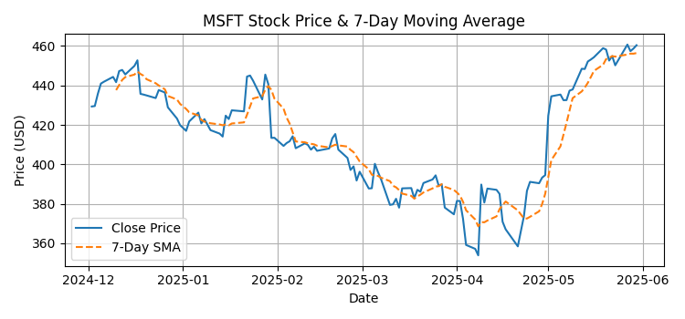

# MSFT Stock Analysis

This project performs a financial analysis of Microsoft Corporation (Ticker: `MSFT`) using historical stock data retrieved from Yahoo Finance. The analysis focuses on price trends, daily returns, volatility, trading volume, and identifying abnormal price movements (spikes).

## Features

* Download 6 months of historical stock data using the `yfinance` API
* Compute and visualize:

  * Daily returns (`Daily Return`)
  * 7-day simple moving average (`7-Day SMA`)
  * 14-day rolling volatility (`Volatility (14d)`)
  * Daily trading volume
  * Days with significant growth or drops (spikes)
* Save results as:

  * PNG charts for all metrics
  * Cleaned and enriched CSV file

## Project Structure

```
├── .gitignore
├── msft_analysis.py                        # Main analysis script
├── microsoft.csv                           # Exported data file (auto-generated)
├── msft_stock_price_&_7-day_moving_average.png
├── msft_daily_return.png
├── msft_volatility_14d.png
├── msft_spike_days_return.png
├── msft_volume_&_volatility_14d.png
├── requirements.txt
└── README.md
```

## Requirements

Make sure you have Python 3.7+ and the following Python packages:

```bash
pip install -r requirements.txt
```

## Getting Started

Clone the repository and run the analysis script:

```bash
python microsoft.py
```

All charts will be saved as PNG files in the working directory, and the processed data will be exported as `microsoft.csv`.

## Sample Output


